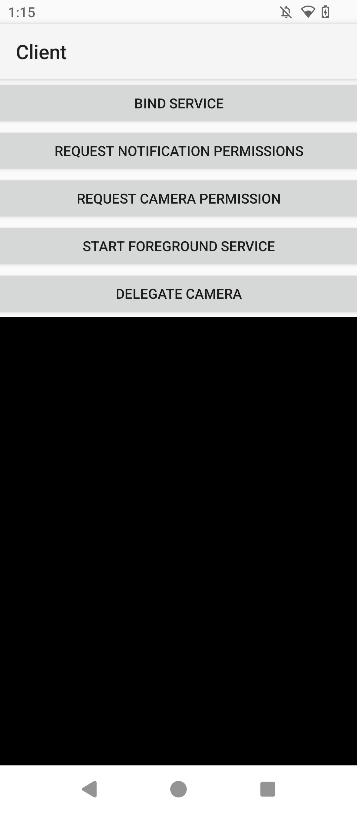
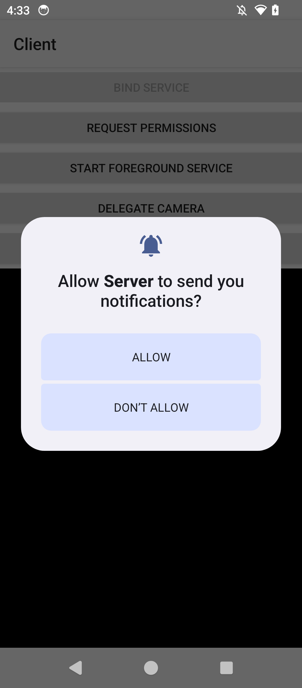
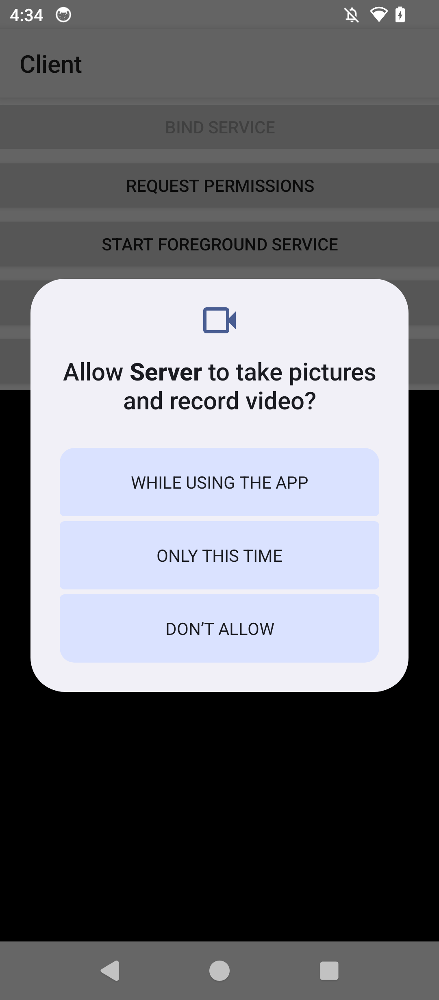
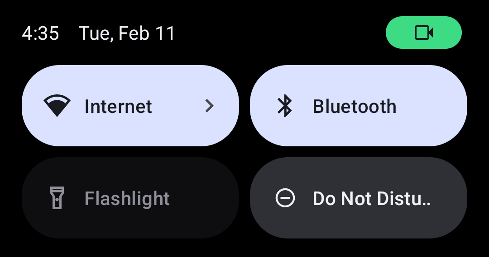
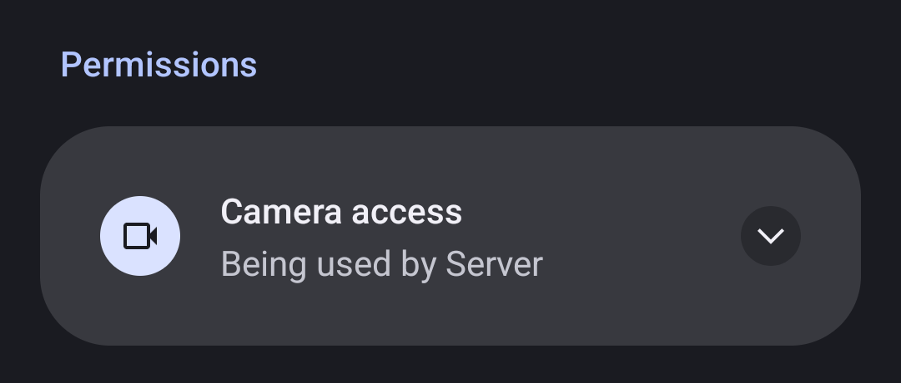
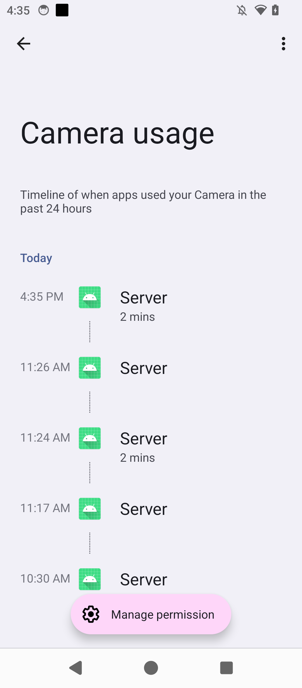

# Android Camera Delegation Proof of Concept

This project is a proof of concept consisting of 2 small Android apps. It shows
how one app can display a camera feed that originates in another app.

The "Client" app, which displays the video, requires no user permissions and
doesn't get recorded by the system as having accessed the camera.

The "Server" app requires the user to grant it permissions, and gets recorded as
having accessed the camera.

## Building and Installing

This is an [Android Studio](https://developer.android.com/studio) project
(actually 2 projects - one for each app). Follow the Android Studio
documentation to open the projects, build, and install in the typical Android
Studio way. Alternatively, you can install the Android command-line tools and
install pre-built APKs (from the
[Releases](https://github.com/glennhartmann/camera-delegation-poc/releases)
page, for example) with `adb install`.

## Using

### Server

The Server app is very straightforward to run directly, but is also unexciting
and pretty useless. It just connects directly to the camera (after requesting
permission, if necessary), and displays it on-screen. It does not attempt to
connect to the Client app.

The Server app's real purpose is not to be run directly, but to be invoked from
the Client app to delegate the permissions and video feed.

### Client

First make sure both the Client and Server apps are installed on the device,
then launch the Client app.

Tap the "BIND SERVICE" button to bind to the Server app's exposed Camera
Service. When or if the connection succeeds, the rest of the buttons will be
enabled. You can also follow the logs in Android's `logcat` to follow the
sequence of events.

Tap the "REQUEST PERMISSIONS" button to get prompts for Notification and Camera
permissions from the Server app (assuming you haven't already granted them).
Allow them both.

Tap the "START FOREGROUND SERVICE" button (note that it's actually possible to
do this step before even binding to the service - but only if the Server app has
already been granted permissions).

Optionally - you can wait for a few seconds and note that the Server displays a
notification indicating that it's running a foreground service.

Finally, tap the "DELEGATE CAMERA" button. The black box in the Client app
should start showing a video feed from your camera.

Notice at this point that there's an icon in the notification area that
indicates that the camera is in use.

Tapping on the icon reveals that Server is using the camera.

Digging a bit deeper, the device's Camera usage history page shows that only
Server (not Client) accessed the camera.

## How it works

1.  Server [declares](Server/app/src/main/AndroidManifest.xml#L44-L49) a
    [foreground
    service](https://developer.android.com/develop/background-work/services/fgs)
    with type="camera", and also declares [all necessary
    permissions](Server/app/src/main/AndroidManifest.xml#L11-L18). The exposed
    servicecan also be
    [bound](https://developer.android.com/develop/background-work/services/bound-services)
    to via its [AIDL
    API](Server/app/src/main/aidl/dev/hartmanng/server/ICameraService.aidl).
    Additionally, the Client
    [declares](Client/app/src/main/AndroidManifest.xml#L11-L13) that it wants to
    call into the Server.

2.  Upon "BIND SERVICE" button press, the client
    [binds](Client/app/src/main/java/dev/hartmanng/client/ServerCameraServiceManager.java#L70-L71)
    to the Server's CameraService.

3.  Upon "REQUEST PERMISSIONS" button press, the Client
    [fetches](Client/app/src/main/java/dev/hartmanng/client/ServerCameraServiceManager.java#L131)
    a
    [PendingIntent](https://developer.android.com/reference/android/app/PendingIntent)
    to
    [PermissionRequestActivity](Server/app/src/main/java/dev/hartmanng/server/PermissionRequestActivity.java)
    from the Server via the bound service. This `PendingIntent` is then sent
    along with another `PendingIntent` back to Client's
    [MainActivity](Client/app/src/main/java/dev/hartmanng/client/MainActivity.java).

    Note that on Android 14+, this `PendingIntent` only works because we [opted
    in](Client/app/src/main/java/dev/hartmanng/client/ServerCameraServiceManager.java#L135-L136)
    to background activity start ([more
    details](https://developer.android.com/guide/components/activities/background-starts))

4.  In the Server code, `PermissionRequestActivity` starts up invisibly (thanks
    to its [style](Server/app/src/main/res/values/styles.xml)), and immediately
    [requests the desired
    permission](Server/app/src/main/java/dev/hartmanng/server/PermissionRequestActivity.java#L62-L63)
    (Notification permission in this case).

    Note that the permission request is run in the Server, so the user grants or
    denies permissions for the Server app, not for the Client app. This follows
    the delegated permission request pattern established in the WebAPK Shell's
    [WebApkServiceImplWrapper](https://source.chromium.org/chromium/chromium/src/+/main:chrome/android/webapk/shell_apk/src/org/chromium/webapk/shell_apk/WebApkServiceImplWrapper.java;l=138-147)
    and
    [NotificationPermissionRequestActivity](https://source.chromium.org/chromium/chromium/src/+/main:chrome/android/webapk/shell_apk/src/org/chromium/webapk/shell_apk/NotificationPermissionRequestActivity.java).

    Also note that Notification permission is only required since Android 13.

5.  Once the permission dialog closes, we
    [finish](Server/app/src/main/java/dev/hartmanng/server/PermissionRequestActivity.java#L77)
    the `PermissionRequestActivity` and [send the callback
    PendingIntent](Server/app/src/main/java/dev/hartmanng/server/PermissionRequestActivity.java#L88)
    back to the Client.

6.  Back on the Client, we open a _new_ `MainActivity` instance and immediately
    [call into the registered callback
    function](Client/app/src/main/java/dev/hartmanng/client/MainActivity.java#L112),
    which in this case will be [a second permission
    request](Client/app/src/main/java/dev/hartmanng/client/ServerCameraServiceManager.java#L84-L91)
    (this time for Camera permission), and then finishes.

7.  The permission request flow works the same as last time, but this time we
    don't register another callback - once the Camera permission dialog closes,
    the user is back in the original Client `MainActivity` instance, awaiting
    user input.

8.  Upon "START FOREGROUND SERVICE" button press, the Client [asks the server to
    start its foreground
    service](Client/app/src/main/java/dev/hartmanng/client/ServerCameraServiceManager.java#L102),
    and the Server, of course,
    [complies](Server/app/src/main/java/dev/hartmanng/server/CameraServiceImpl.java#L35-L51).

    Note that the foreground service can actually be started before binding to
    it, but the Server app must already have permissions or the foreground
    service will crash on startup.

    Also note that since Android 11, we are required to [declare the foreground
    service
    type](Server/app/src/main/java/dev/hartmanng/server/CameraServiceImpl.java#L48-L49).

    Finally, note that the reason we need a foreground service in the first
    place is that camera access is not allowed in background services. Trying to
    delegate the camera without a foreground service running will result in
    `connect(): camera access exception:
    android.hardware.camera2.CameraAccessException: CAMERA_DISABLED (1):
    connectHelper:2059: Camera "0" disabled by policy`

9.  Upon "DELEGATE CAMERA" button press, the Client
    [sends](Client/app/src/main/java/dev/hartmanng/client/ServerCameraServiceManager.java#L112)
    its [Surface](https://developer.android.com/reference/android/view/Surface)
    (embedded in `MainActivity`'s VideoView widget) to the Server via the bound
    service.

10. On the Server side, we select a camera (in this case, just the first camera
    in the list - in production there are of course better ways), [start a
    CameraCaptureSession](Server/app/src/main/java/dev/hartmanng/server/CameraManager.java#L41-L42),
    and [set a repeating
    request](Server/app/src/main/java/dev/hartmanng/server/CameraManager.java#L69-L70)
    using the Client's `Surface`. For more details on the camera setup, session,
    and capture process, see the [camera2
    documentation](https://developer.android.com/media/camera/camera2).

## Notes

These are not meant to be a production quality apps. They are proof-of-concept
quality and cut numerous corners.

For example, the following situations are not handled properly in this demo:

* camera errors and disconnects (when switching between apps you may see
  `Session 0: Exception while unconfiguring outputs:
  android.hardware.camera2.CameraAccessException: CAMERA_DISCONNECTED (2):
  checkPidStatus:2157: The camera device has been disconnected` or `Session 0:
  Exception while stopping repeating:
  android.hardware.camera2.CameraAccessException: CAMERA_ERROR (3):
  cancelRequest:609: Camera 0: Error clearing streaming request: Function not
  implemented (-38)` or similar errors in logs)
* `onConfigureFailed` is not handled in the Server's `CameraManager`
* proper selection of which camera to use is not implemented
* we don't check if notification permission was actually granted before starting
  the foreground service (foreground services are supposed to be [required to
  show a notification when they're
  running](https://developer.android.com/develop/background-work/services/fgs),
  but it still seems to work without - this may be a Play Policy violation?)
* switching between apps may result in the Client ending up with a null
  `mServerCameraServiceManager` pointer in `MainActivity`

In addition, the following clean-up code is not properly implemented:

* camera access (if you switch back and forth between Client and Server apps,
  particularly if you didn't start the foreground service before attempting to
  attach to the camera, you may start seeing `connect(): camera access
  exception: android.hardware.camera2.CameraAccessException: CAMERA_IN_USE (4):
  connectHelper:2049: Camera "0" is already open` in logs in some cases)
* surfaces (you may see
  `[SurfaceView[dev.hartmanng.client/dev.hartmanng.client.MainActivity] . . .
  queueBuffer: BufferQueue has been abandoned` in logs)
* foreground service (it keeps running after both apps are closed)

Other misc notes:

* when connecting the Client to the camera, logs show `Recent tasks don't
  include camera client package name: dev.hartmanng.server`. It seems to work
  anyway, but it doesn't sound like Android's happy about it
* I'm not that happy about how the server callback is stored as global state in
  the Client's `MainActivity`
* requesting permissions from the Client app may leave an extra useless
  all-black activity in Android's "recent apps" stack (presumably left over from
  `PermissionRequestActivity`)
* if you see `connect(): camera access exception:
  android.hardware.camera2.CameraAccessException: CAMERA_DISABLED (1):
  connectHelper:2059: Camera "0" disabled by policy` in the logs, this probably
  means you tried to connect the camera when the foreground service wasn't
  running
