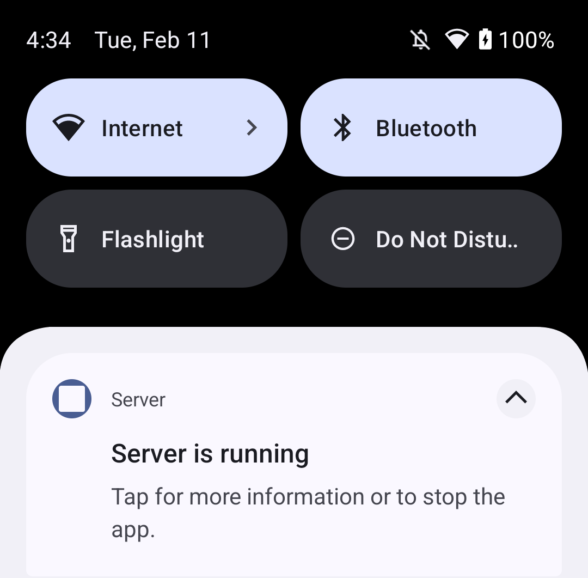

# Android Camera Delegation Proof of Concept

This project is a proof of concept consisting of 2 small Android apps. It shows
how one app can display a camera feed that originates in another app.

The "Client" app, which displays the video, requires no user permissions and
doesn't get recorded by the system as having accessed the camera.

The "Server" app requires the user to grant it permissions, and gets recorded as
having accessed the camera.

Note that this branch is a "minimized" version of the apps that does less error
checking and more unsafe stuff in order to simplify the code as much as
possible. See the [main
branch](https://github.com/glennhartmann/camera-delegation-poc/tree/main)
for the "full" version.

## Building and Installing

This is an [Android Studio](https://developer.android.com/studio) project
(actually 2 projects - one for each app). Follow the Android Studio
documentation to open the projects, build, and install in the typical Android
Studio way. Alternatively, you can install the Android command-line tools and
install pre-built APKs (from the
[Releases](https://github.com/glennhartmann/camera-delegation-poc/releases)
page, for example) with `adb install`.

## Using

### Server

The Server app is very straightforward to run directly, but is also completely
useless. It's just a blank, empty activity that does literally nothing at all.

The Server app's real purpose is not to be run directly, but to be invoked from
the Client app to delegate the permissions and video feed.

### Client

First make sure both the Client and Server apps are installed on the device,
then launch the Client app.

Tap the "BIND SERVICE" button to bind to the Server app's exposed Camera
Service. It may take a second or two - you can follow the logs in Android's
`logcat` to follow the sequence of events.

Tap the "REQUEST NOTIFICATION PERMISSION" button to get a prompt for
Notification permission from the Server app (assuming you haven't already
granted it).

Allow the permission, then do the same with the "REQUEST CAMERA PERMISSION"
button to allow camera permission.

Next, tap the "START FOREGROUND SERVICE" button (note that it's actually
possible to do this step before even binding to the service - but only if the
Server app has already been granted permissions).

Optionally - you can wait for a few seconds and note that the Server displays a
notification indicating that it's running a foreground service.

Finally, tap the "DELEGATE CAMERA" button. The black box in the Client app
should start showing a video feed from your camera.

Notice at this point that there's an icon in the notification area that
indicates that the camera is in use.

Tapping on the icon reveals that Server is using the camera.

Digging a bit deeper, the device's Camera usage history page shows that only
Server (not Client) accessed the camera.

## How it works

1. Server [declares](Server/app/src/main/AndroidManifest.xml#L44-L49) a
   [foreground
   service](https://developer.android.com/develop/background-work/services/fgs)
   with type="camera", and also declares [all necessary
   permissions](Server/app/src/main/AndroidManifest.xml#L11-L18). The exposed
   servicecan also be
   [bound](https://developer.android.com/develop/background-work/services/bound-services)
   to via its [AIDL
   API](Server/app/src/main/aidl/dev/hartmanng/server/ICameraService.aidl).
   Additionally, the Client
   [declares](Client/app/src/main/AndroidManifest.xml#L11-L13) that it wants to
   call into the Server.

2. Upon "BIND SERVICE" button press, the client
   [binds](Client/app/src/main/java/dev/hartmanng/client/MainActivity.java#L69-L70)
   to the Server's CameraService.

3. Upon "REQUEST NOTIFICATION PERMISSION" button press, the Client
   [fetches](Client/app/src/main/java/dev/hartmanng/client/MainActivity.java#L96)
   a
   [PendingIntent](https://developer.android.com/reference/android/app/PendingIntent)
   to
   [PermissionRequestActivity](Server/app/src/main/java/dev/hartmanng/server/PermissionRequestActivity.java)
   from the Server via the bound service. This `PendingIntent` is then sent to
   the Server.

   Note that on Android 14+, this `PendingIntent` only works because we [opted
   in](Client/app/src/main/java/dev/hartmanng/client/MainActivity.java#L99-L100)
   to background activity start ([more
   details](https://developer.android.com/guide/components/activities/background-starts)).

4. In the Server code, `PermissionRequestActivity` starts up invisibly (thanks
   to its [style](Server/app/src/main/res/values/styles.xml)), and immediately
   [requests the desired
   permission](Server/app/src/main/java/dev/hartmanng/server/PermissionRequestActivity.java#L40-L42)
   (Notification permission in this case).

   Note that the permission request is run in the Server, so the user grants or
   denies permissions for the Server app, not for the Client app. This follows
   the delegated permission request pattern established in the WebAPK Shell's
   [WebApkServiceImplWrapper](https://source.chromium.org/chromium/chromium/src/+/main:chrome/android/webapk/shell_apk/src/org/chromium/webapk/shell_apk/WebApkServiceImplWrapper.java;l=138-147)
   and
   [NotificationPermissionRequestActivity](https://source.chromium.org/chromium/chromium/src/+/main:chrome/android/webapk/shell_apk/src/org/chromium/webapk/shell_apk/NotificationPermissionRequestActivity.java).

   Also note that Notification permission is only required since Android 13.

5. Once the permission dialog closes, we
   [finish](Server/app/src/main/java/dev/hartmanng/server/PermissionRequestActivity.java#L56)
   the `PermissionRequestActivity` and return the user back to the original
   Client `MainActivity` instance, awaiting input.

6. The exact same flow repeats upon "REQUEST CAMERA PERMISSION" button press.

7. Upon "START FOREGROUND SERVICE" button press, the Client [asks the server to
   start its foreground
   service](Client/app/src/main/java/dev/hartmanng/client/MainActivity.java#L82),
   and the Server, of course,
   [complies](Server/app/src/main/java/dev/hartmanng/server/CameraServiceImpl.java#L54-L68).

   Note that the foreground service can actually be started before binding to
   it, but the Server app must already have permissions or the foreground
   service will crash on startup.

   Also note that since Android 11, we are required to [declare the foreground
   service
   type](Server/app/src/main/java/dev/hartmanng/server/CameraServiceImpl.java#L68).

   Finally, note that the reason we need a foreground service in the first place
   is that camera access is not allowed in background services. Trying to
   delegate the camera without a foreground service running will result in
   `connect(): camera access exception:
   android.hardware.camera2.CameraAccessException: CAMERA_DISABLED (1):
   connectHelper:2059: Camera "0" disabled by policy`

8. Upon "DELEGATE CAMERA" button press, the Client
   [sends](Client/app/src/main/java/dev/hartmanng/client/MainActivity.java#L86-L87)
   its [Surface](https://developer.android.com/reference/android/view/Surface)
   (embedded in its VideoView widget) to the Server via the bound service.

9. On the Server side, we select a camera (in this case, just the first camera
   in the list - in production there are of course better ways), [start a
   CameraCaptureSession](Server/app/src/main/java/dev/hartmanng/server/CameraManager.java#L37-L38),
   and [set a repeating
   request](Server/app/src/main/java/dev/hartmanng/server/CameraManager.java#L62-L63)
   using the Client's `Surface`. For more details on the camera setup, session,
   and capture process, see the [camera2
   documentation](https://developer.android.com/media/camera/camera2).

## Notes

These are not meant to be a production quality apps. They are proof-of-concept
quality and cut numerous corners.

It's kind of pointless to list out all the deficiencies of this implementation
since it's intentionally minimized to reduce code complexity as much as
possible. In particular, we rely heavily on the user pressing the buttons in
order and relatively (compared to a computer) slowly - this lets us avoid
synchronizing logic and just assume that the previous step has completed by the
time we want to start the next step.

Refer to the [notes section on the main
branch](https://github.com/glennhartmann/camera-delegation-poc/tree/main?tab=readme-ov-file#notes)
for a few details, but know that this minimized version has even more corner
cutting, less cleaning up after ourselves, fewer safety checks (eg checking that
things aren't `null`), etc.
